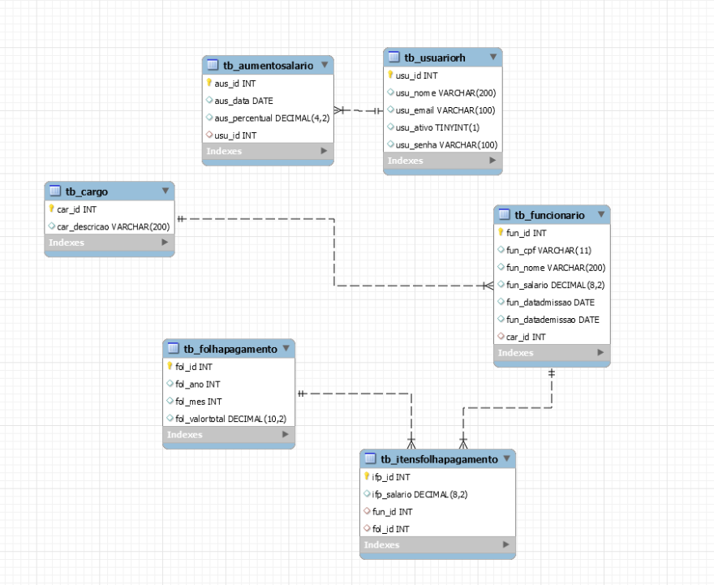

# 📌 API para um sistema de Recursos Humanos

Você foi contratado por uma empresa de desenvolvimento e, durante o processo seletivo, o RH identificou suas excelentes habilidades em **backend**.  

Sua missão é desenvolver uma **API interna** para gerenciar funcionários, aplicar aumentos salariais e gerar folhas de pagamento.

---

## 🗂 Modelo Relacional

📥 [Clique aqui para baixar o script do banco de dados](bd.sql)

---

## 🚀 Funcionalidades

### 👥 Gerenciamento de Funcionários
- **Cadastro de funcionários**
  - Cadastrar dados na tabela `tb_funcionario`
  - O campo `fun_datademissao` não é obrigatório

- **Exclusão de funcionários (exclusão lógica)**
  - Atualizar a coluna `fun_datademissao` com a data atual no momento da requisição

---

### 💰 Aumento Salarial
- Aplicar aumento a **todos os funcionários ativos** por percentual
- Persistir em tabela dedicada com:
  - Data do aumento
  - Percentual aplicado
  - Usuário responsável

📌 **Exemplo:**  
Salário atual: `R$ 1100`  
Aumento: `10%`  
Novo salário: `R$ 1210 (1100 + 110)`

---

### 📄 Folha de Pagamento
A folha será dividida em **duas tabelas**:

1. **tb_folhapagamento**
   - Contém `mês`, `ano` e `valor total`

2. **tb_itensfolhapagamento**
   - Lista salários dos funcionários no momento da geração
   - Relacionamento com a folha correspondente

⚠️ **Regras importantes**:
- Usar **transações no banco** para evitar inconsistências
- Funcionários **demitidos** não devem ser considerados

---

### 🔐 Autenticação (JWT)
- Autenticação baseada na tabela `tb_usuariorh`
- Endpoint para **gerar token JWT**
- Middleware para **validar o token**
- Todos os endpoints (exceto geração do token) devem ser protegidos
- Token expira a cada **5 horas**

---

## ✅ Resumo das Funcionalidades
- [x] Cadastro de funcionários  
- [x] Exclusão lógica de funcionários  
- [x] Aumento salarial com persistência de registro  
- [x] Geração de folha de pagamento com transação  
- [x] Autenticação via JWT  

---

## 📦 Projeto Inicial
📥 [Clique aqui para baixar o projeto base](#)

---

## 🏁 Observações
- Funcionários **demitidos** não devem ser considerados em:
  - Aumento salarial
  - Folha de pagamento

---
